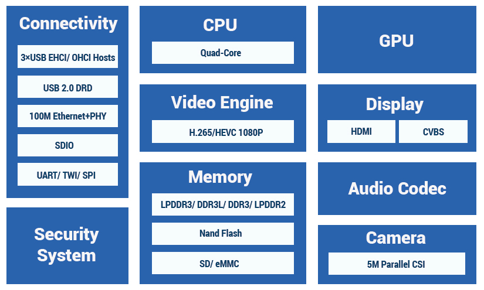
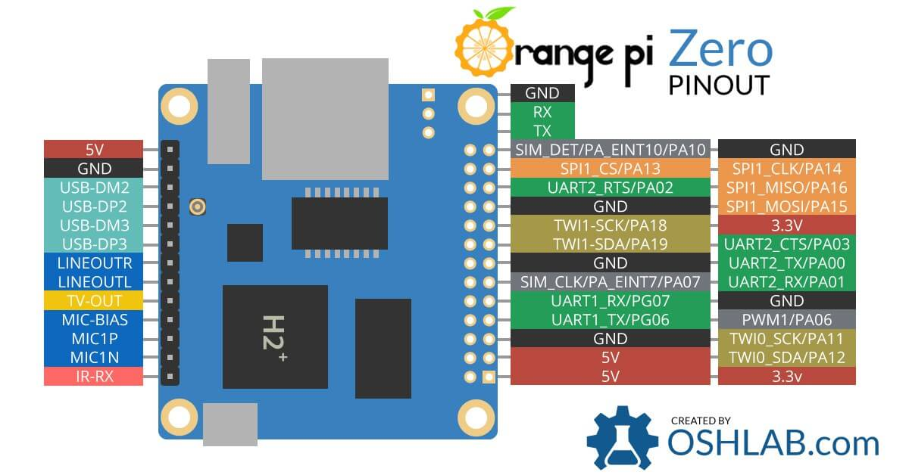
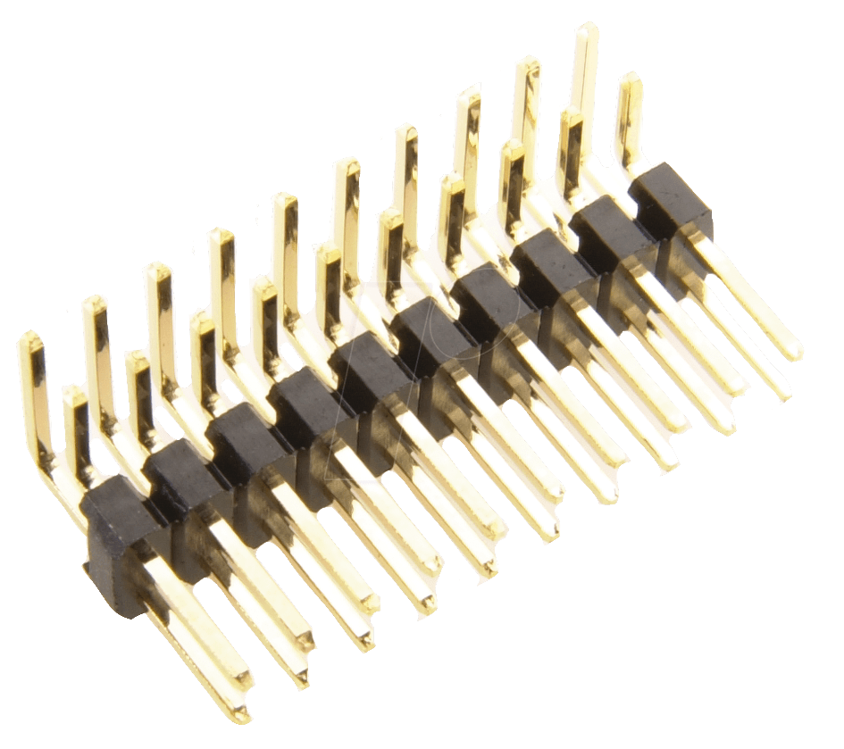
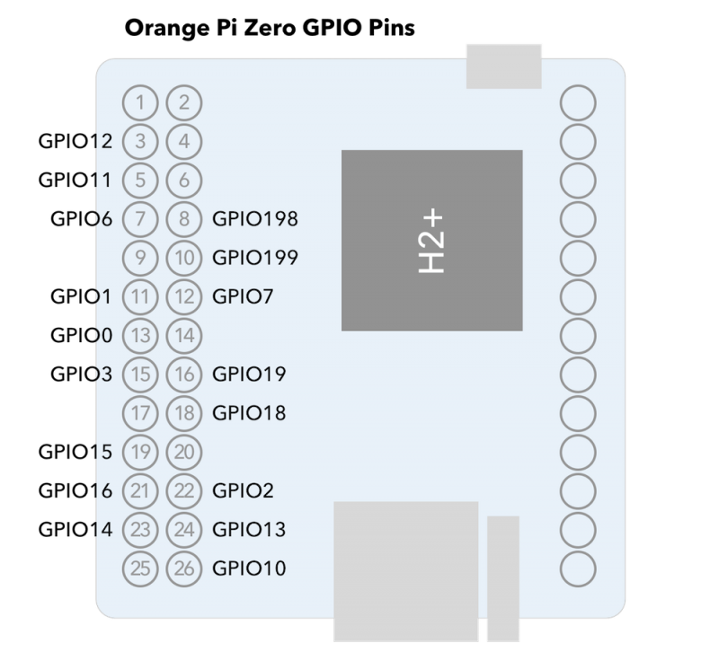
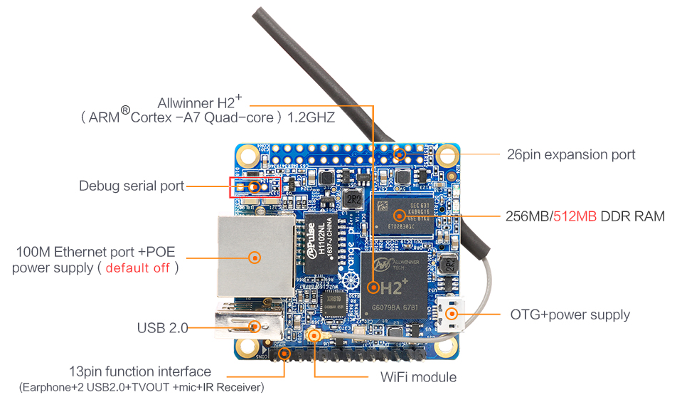
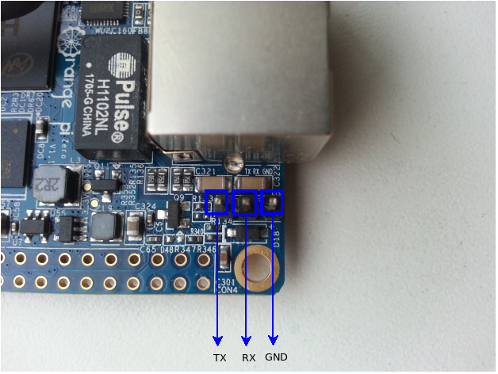
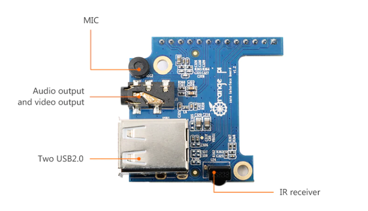
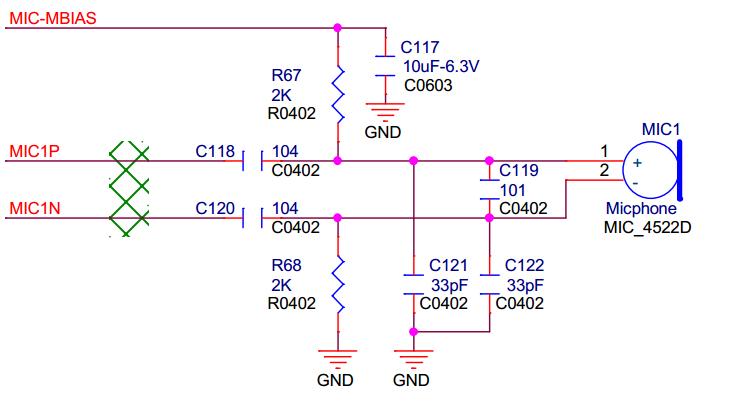
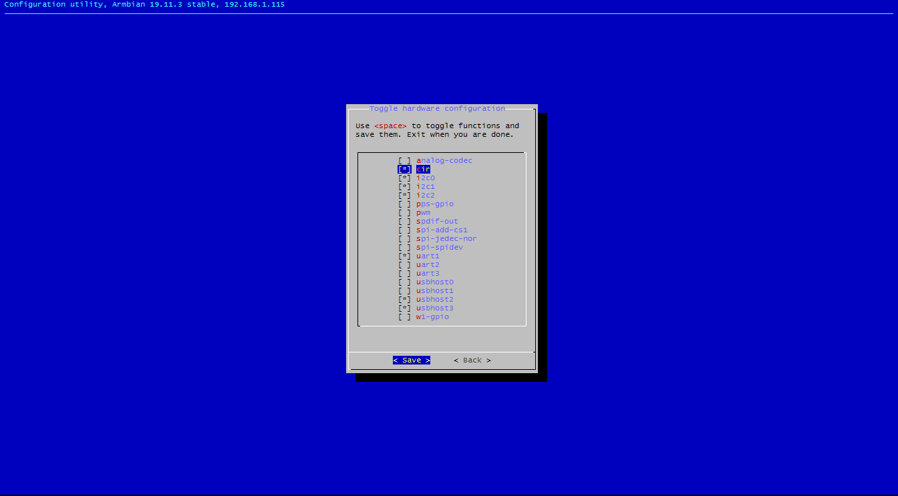

# OrangePi Zero

[TOC]


## Hardware

> :camera: *Orange Pi Zero v1.5*
> 


The OrangePi Zero is a Single Board Computer made by [Shenzhen Xunlong Software CO., Limited](http://www.xunlong.tv/), a company located in Shenzhen, Guangdong, China.

### SoC

It is based on a downgraded version of the famous AllWinner [H3](http://www.allwinnertech.com/index.php?c=product&a=index&id=47) (it lacks Gigabit MAC and 4K HDMI output support), named [H2+](http://www.allwinnertech.com/index.php?c=product&a=index&id=62).

> :camera: *H2 description by AllWinner*
> 

On the Zero, not all the [features of the H2+](http://wiki.friendlyarm.com/wiki/images/0/08/Allwinner_H2%2B_Datasheet_V1.2.pdf) are hardwired. So we don't have any camera, HDMI nor Nand Flash.

CPU

- Quad-core Cortex™-A7 running from 480MHz to 1008MHz

GPU

- Muti-Core Mali400 GPU 
- Supports OpenGL ES 2.0

Display

- ~~Supports 1080P HDMI output with HDCP~~
- ~~Supports HDMI CEC~~ 
- ~~Supports HDMI 30 function~~ 
- Integrated [CVBS](https://en.wikipedia.org/wiki/Composite_video) 
- ~~Supports simultaneous output of HDMI and CVBS~~
  	

Memory

- Supports LPDDR2/ LPDDR3/ DDR3/ DDR3L SDRAM 
- Supports 8-bit SLC/MLC/TLC/EF NANO with 64-bit ECC 
- Supports SD/~~eMMC/tSD/fSD/efSD~~


Video

- Supports multi-format 1080p@60fps video decoding, including H.265/HEVC, H.264 BP/MP/HP, VP8, MPEGl/2, MPEG4 SP/ASP GMC, H.263 including Sorenson Spark, WMV9/VC- l,JPEG/MJPEG, etc
- Supports H.264 1080p@30fps video encoding
  	

~~Camera~~

- ~~Supports 8-bit YUV422 CMOS sensor interface~~ 
- ~~Supports CCIR656 protocol for NTSC and PAL~~ 
- ~~Supports 5M pixel camera sensor~~ 
- ~~Supports video capture solution up to 1080p@30fps~~ 

### Pinout

#### 1x13 Header

> :camera: *OrangePi Zero Pinout by OSHLab.com*
> 

On the board itself, there is a first row of pins that reflect a few features of the SoC:

| 1x13 Header |                                                              |
| ----------- | ------------------------------------------------------------ |
| 1           | *5V*                                                         |
| 2           | *GND*                                                        |
| 3           | USB-DM2 (combined to the pin #4, 5V and GND, this makes a USB port) |
| 4           | USB-DP2                                                      |
| 5           | USB-DM3 (combined to the pin #6, 5V and GND, this makes a USB port) |
| 6           | USB-DP3                                                      |
| 7           | LINEOUTR (audio output Right side)                           |
| 8           | LINEOUTL (audio output Left side)                            |
| 9           | TV-OUT (The default mode is PAL, with 720x576 resolution)    |
| 10          | MIC-BIAS                                                     |
| 11          | MIC1P                                                        |
| 12          | MIC1N                                                        |
| 13          | [CIR](http://linux-sunxi.org/CIR)-RX (Infrared input)        |

#### 2x13 Header

On the opposite side, we'll find an unpopulated series of holes. To connect more easily Dupont cables, one could solder a 2 x 13-pin header, angled, pitch 2.54 like this [one](https://www.reichelt.de/2-x-13-pin-header-angled-pitch-2-54-sl-2x13w-2-54-p19491.html?&trstct=pol_10):


> :camera: *2 x 13-pin header, angled, pitch 2.54 by Reichelt.de*
> 

| 2 × 13 Header |                                          |      |                                                   |
| ------------- | ---------------------------------------- | ---- | ------------------------------------------------- |
| 1             | *3,3 V*                                  | 2    | *5V*                                              |
| 3             | PB21 TWI2-SDA / TWI0_SDA / PA12 / GPIO12 | 4    | *5V*                                              |
| 5             | PB20 TWI2-SCK / TWI0_SCK / PA11 / GPIO11 | 6    | *GND*                                             |
| 7             | PI3 PWM1 / PA06 / GPIO6                  | 8    | PH0 UART3_TX / UART1_TX / PG06 / GPIO198          |
| 9             | *GND*                                    | 10   | PH1 UART3_RX / UART1_RX / PG07 / GPIO199          |
| 11            | PI19 UART2_RX / PA01 / GPIO1             | 12   | PH2 / SIM_CLK / PA_EINT7 / PA07 / GPIO7           |
| 13            | PI18 UART2_TX / PA00 / GPIO0             | 14   | *GND*                                             |
| 15            | PI17 UART2_CTS / PA03 / GPIO3            | 16   | PH20 CAN_TX / TWI1-SDA / PA19 / GPIO19            |
| 17            | *3,3 V*                                  | 18   | PH21 CAN_RX / TWI1-SCK / PA18 / GPIO18            |
| 19            | PI12 SPI0_MOSI / PA15 / GPIO15           | 20   | *GND*                                             |
| 21            | PI13 SPI0_MISO / PA16 / GPIO16           | 22   | PI16 UART2_RTS / UART2_RTS / PA02 / GPIO2         |
| 23            | PI11 SPI0_CLK / PA14 / GPIO14            | 24   | PI10 SPI0_CS0 / SPI1_CS / PA13 / GPIO13           |
| 25            | *GND*                                    | 26   | PI14 SPI0_CS1 / SIM_DET/PA_EINT10 / PA10 / GPIO10 |

The numbers on the board are not the numbers that you will be able to use in your program.

> :camera: *OrangePi Zero Pinout by micro-pi.ru*
> 

As seen [there](https://kaspars.net/blog/orange-pi-zero-gpio), there is a formula that will help you to get the GPIO number when you have the pin number:

```bash
(Position of letter in alphabet - 1) * 32 + Pin number
```

For example, port `PB12` would map to `GPIO 44`:

```bash
(2 - 1) * 32 + 12 = 44
```

> :camera: *OrangePi Zero Pinout by kaspars.net*
> 

Here is a more detailed pinout:

> :camera: *detailed pinout courtesy of [MySensors](https://www.mysensors.org/build/orange)*
> ](C:\support\users\arm\documentation\docs\assets\images\Orange-Pi-Zero-pinout.jpg)

#### Serial console

A UART or serial console will be a life-saver when anything goes  wrong. The serial interface pins lies next to the Ethernet plug:

> :camera: *OrangePi Zero top by OrangePi*
> 

To connect to the board in case of problem, or if you don't have SSH installed, you need a TTL to USB converter like this [one](https://fr.aliexpress.com/item/32844850903.html?spm=a2g0w.12010615.8148356.2.302667c4KZJ6eL):

> :camera: *OrangePi USB2UART*
> 

The RX an TX pins have to be connected to the TX and RX pins of the USB Serial converter respectively.

> :camera: *UART by Codelectron*
> 

So TX goes to RX, RX goes to TX, GND goes to GND. We could also connect the converter to the pins 11 or 10 (RX, to connect to TX) and 13 or 8 (TX, to connect to RX).

Setting up the connection from another machine (Windows or Linux) will be detailed later in this document.

### OrangePi documentation and source code

#### User manual

The user manual can be found there: [https://mega.nz/#!K11y1YhY!aaKAcEvmyfaRHzoesHtjktgULdCDGyAW5FKweDWVSfo](https://mega.nz/#!K11y1YhY!aaKAcEvmyfaRHzoesHtjktgULdCDGyAW5FKweDWVSfo).
The NAS user manual can be found there: [http://www.orangepi.org/download/ORANGE_PI-Zero-NAS-V1_1_user_manual.pdf](http://www.orangepi.org/download/ORANGE_PI-Zero-NAS-V1_1_user_manual.pdf).

#### Mechanical schematics

The DXF drawing for the LTS version can be found there: [http://www.orangepi.org/download/ORANGE_PI-Zero-V1_5_mechanical.dxf](http://www.orangepi.org/download/ORANGE_PI-Zero-V1_5_mechanical.dxf).
The DXF drawing for the 1.1 version can be found there: [http://www.orangepi.org/download/ORANGE_PI-Zero-V1_1_PCB-DWG.rar](http://www.orangepi.org/download/ORANGE_PI-Zero-V1_1_PCB-DWG.rar).

#### Electronic schematics

The electronic schematics for the LTS version can be found there: [http://www.orangepi.org/download/ORANGE_PI-ZERO_V_1_5.pdf](http://www.orangepi.org/download/ORANGE_PI-ZERO_V_1_5.pdf).
The electronic schematics for the 1.11 version can be found there: [http://www.orangepi.org/download/orange_pi-zero-v1_11.pdf](http://www.orangepi.org/download/orange_pi-zero-v1_11.pdf).

#### Source code

The Android SDK source code can be found there: [https://mega.nz/#F!r8tX2Lzb!OnL-ZKHmWGxnNN2uAc4GNQ](https://mega.nz/#F!r8tX2Lzb!OnL-ZKHmWGxnNN2uAc4GNQ).
The Linux source code can be found there: [https://github.com/orangepi-xunlong](https://github.com/orangepi-xunlong).

## Linux

### OrangePi's Debian

OrangePi [supplies](https://drive.google.com/open?id=1DAQEVauaeIq3p257zpm4-cHQY7AvxNR6) a Debian desktop version for the Zero LTS (supposedly the v1.5), the latest being from September 2019 (orangepi/orangepi).
OrangePi [supplies](https://mega.nz/#!ilt1RbrC!pS6C4km53HefFg_G-RWAN2ucJNb1b7T8REVQSa88Wf8) a Debian xfce desktop version for the Zero, the latest being from 2016-12-05 (root/orangepi).
OrangePi [supplies](https://mega.nz/#!fg911AIZ!QY0vxXeh-kzCuqI9zGWkRCKbuXdWiqhC3-f_SopR560) a Debian server version for the Zero, the latest being from 2016-12-01 (root/orangepi).

### OrangePi's Ubuntu

OrangePi [supplies](https://mega.nz/#!CtkTRSTZ!ekaVjnbuy7R6wpR9KDGZEaLa5vv437Guqlx3HDmYYDc) a Ubuntu server version for the Zero, the latest being from 2016-11-24. (orangepi/orangepi)
The Ubuntu Core they [supply](https://mega.nz/#F!MKQSUIbS!reCl8EK0QqjnOoC-e2ZwBg) is from 2018-02-05. (orangepi/orangepi)
The Lubuntu they [supply](https://mega.nz/#!KpN3wDaB!o5NW2tSrPMFDVYZfrySauhvkpLDBjZ4pkHQFnCUfvdY) is from 2016-11-25. (orangepi/orangepi)

### Armbian

Armbian [supplies](https://dl.armbian.com/orangepizero/Buster_current.torrent) Armbian Buster with mainline based kernel 5.3.y.
Armbian [supplies](https://dl.armbian.com/orangepizero/Bionic_current.torrent) Armbian Bionic with mainline based kernel 5.3.y.
They also supply other versions of Armbian, not all of them are supported: [Bionic server](https://dl.armbian.com/orangepizero/Bionic_current), [Buster server](https://dl.armbian.com/orangepizero/Buster_current), [Buster minimal](https://dl.armbian.com/orangepizero/Buster_dev_minimal_nightly), [Disco server](https://dl.armbian.com/orangepizero/Disco_current), [Stretch server](https://dl.armbian.com/orangepizero/Stretch_current).

### Others

OrangePi [supplies](https://mega.nz/#F!MKQSUIbS!reCl8EK0QqjnOoC-e2ZwBg) a Raspbian server version for the Zero, the latest being from  2018-02-05 (orangepi/orangepi).
OrangePi [supplies](https://mega.nz/#F!bpcngYxL!Dfqczf4BpDjtanPMbBv4Kg) an OpenWRT version for the Zero, the latest being from 2016-12-05 (root/orangepi).

## Android

### OrangePi Android

OrangePi [supplies](https://drive.google.com/open?id=1Vc2GZmQFq9O__V4pUwsW4Afh7zbfA7cL) an Android KitKat (4.4) version for the Zero LTS, the latest being from August 2019.
OrangePi [supplies](https://mega.nz/#F!X85DSK7S!RJGS50m78y3ZI3TTjy4YBQ) an Android version for the Zero, the latest being from 2018-3-15.
OrangePi [supplies](https://mega.nz/#F!X85DSK7S!RJGS50m78y3ZI3TTjy4YBQ) an Android 7.0 version for the Zero, the latest being from 2018-3-15.

### H3Droid

[H3Droid](https://h3droid.com/) is an Android built for Allwinner H3 and H2+ based devices. The universal installer can be downloaded [there](http://cdn.h3droid.com/h3droid/images/h3droid_installer.img.xz), or on this page: https://h3droid.com/download .

## Connecting the Zero to the outside world

### TVOUT

As seen [there](https://forum.armbian.com/topic/6582-orange-pi-zero-h2h3-tv-out-on-mainline-working/), if you want to get a correct image on the OrangePi Zero, as it is missing  filter circuity from its Composite Output, the most important thing one needs to do is put a 50 ohm resistor between the signal and GND. It is [RCA](https://en.wikipedia.org/wiki/RCA_connector) or "[composite](https://en.wikipedia.org/wiki/Composite_video)" signal: usually on a TV the yellow RCA connector is for composite signal, the white for left audio channel and  the red for right audio channel. Use an RCA connector and get TVOUT from pin 9, left audio from pin 8, right audio from pin 7 and GROUND from where you want.

Then use "TV" or "AV" or "Audio Video" on your TV. 
One could also add the cheap Zero [hat](https://fr.aliexpress.com/item/32770665186.html?spm=a2g0w.12010612.8148356.3.106c7fdd5HGbr9) to get audio/tvout and more USB ports.

> :camera: *OrangePi Zero hat by OrangePi*
> {.center}

### Microphone

Once more, the cheapest and easiest way to connect a microphone to the OrangePi Zero is to use the OrangePi [hat](https://fr.aliexpress.com/item/32770665186.html?spm=a2g0w.12010612.8148356.3.106c7fdd5HGbr9).

The other way is to connect a circuit like this [one](http://www.orangepi.org/orangepibbsen/forum.php?mod=redirect&goto=findpost&ptid=2619&pid=18579&fromuid=1594746) to the three available pins:

> :camera: *Mic circuit by edu_viccini*
> 

The MIC1N, MIC1P, MIC_MBIAS have to be connected to the respective pins of the 1x13 Header (12, 11, 10).

### Sound out

Connect the pins #7 and #8 to a Jack cable, and you're done. If you don't get any sound from it, create a .asoundrc file in your home folder, and put this code in it:

```bash
pcm.!default {
  type hw
  card audiocodec
}
ctl.!default {
  type hw
  card audiocodec
}
```

### InfraRed

The H2+ has an inbuilt IR controller, but no IR receiver on board. You can get a cheap [hat](http://fr.aliexpress.com/item/32770665186.html?spm=a2g0w.12010612.8148356.3.106c7fdd5HGbr9) that will give you more USB ports, TVOUT and an IR receiver, or go your own way and attach one to the GPIO.

#### Attach your own

#### Software

> This micro howto is mostly inspired by [codelectron](http://codelectron.com/how-to-setup-infrared-remote-control-in-orange-pi-zero-using-lircd-and-python/).

On this board, and with Linux in general, infrared control is handled by project [LIRC](http://www.lirc.org/). LIRC allows to decode, and even send infrared signals for lots of commonly used infrared remote controls.
The most important part of LIRC is the daemon `lircd`, which decodes infrared signal received by the device drivers. Il will then provide the information on a Unix socket. 
It will also accept commands for IR signals to be sent if the hardware supports it.
The second daemon program is called `lircmd`. It will connect to lircd and translate the decoded IR signal to mouse movements.

 

```bash
cat /etc/armbian-release
BOARD=orangepizero
BOARD_NAME="Orange Pi Zero"
BOARDFAMILY=sun8i
BUILD_REPOSITORY_URL=https://github.com/armbian/rkbin
BUILD_REPOSITORY_COMMIT=cd0c2bb
DISTRIBUTION_CODENAME=buster
DISTRIBUTION_STATUS=supported
VERSION=19.11.3
LINUXFAMILY=sunxi
BRANCH=current
ARCH=arm
IMAGE_TYPE=stable
BOARD_TYPE=conf
INITRD_ARCH=arm
KERNEL_IMAGE_TYPE=Image
```

In the Armbian version mentioned above, the IR kernel module for Orange Pi is not loaded by default. CIR stands for [Consumer Infra Red](https://en.wikipedia.org/wiki/Consumer_IR).
First of all, we have to install cir support via armbian-config. System -> Hardware -> cir

> :camera: *CIR support install*
> {.center}

Once your machine has rebooted, check if the CIR kernel module is available.

```bash
lsmod |grep sunxi_cir
```

returns nothing. So we have to load the module manually:

```bash
modprobe sunxi_cir
```

After loading the module check if the device node is created and if that exist you can test the incoming IR signal.

```bash
ls /dev/lirc0
# if the above command runs and waits then press any key in your IR remote pointing it to the OPi IR Receiver
```

## Temperature

### Passive cooling

The H2+ chip can run pretty hot, especially on some versions (the infamous 1.4) so a heat sink is not a bad idea. The chip measures 14mmx14mm so [any](https://fr.aliexpress.com/item/32555183226.html?spm=a2g0o.productlist.0.0.2f9c759041qn0w&algo_pvid=c9e3b3cb-787a-4a19-8bd0-23406e02f391&algo_expid=c9e3b3cb-787a-4a19-8bd0-23406e02f391-4&btsid=85e26822-67a9-4bb4-9c2f-8f24a48afc9f&ws_ab_test=searchweb0_0,searchweb201602_7,searchweb201603_53) heat sink of this size could help maintaining a correct temperature.

One can glue the heat sink to the H2+ chip using “heat sink plaster”. This is a thermally conductive substance that  hardens after some time. Another option is to use thermally  conductive double sided adhesive tape. 
If you're thinking of an enclosure to keep dust out of your board, think twice, or upgrade to active cooling.

### Active cooling

Another way of cooling the Zero is to use a fan. It's not such a good idea to plug a fan directly into the GPIO (be it PWM or not), as it could damage the board when slowing down.
You need to have at least a [Schottky diode](https://en.wikipedia.org/wiki/Schottky_diode)  or at least a [resistor and a transistor](https://raspberrypi.stackexchange.com/a/99056/93266) to protect the GPIO, or you can go the full monty with a specific [hat](https://github.com/nopnop2002/OrangePi-ZERO-FAN-HAT).